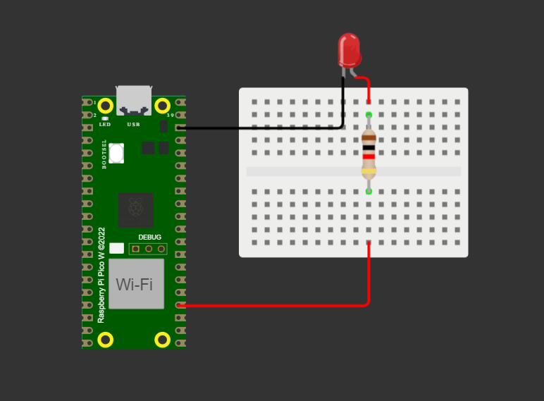

# M8S1

Giovana Lisboa Thomé

Repositório referente à atividade ponderada da semana 1 do módulo 8 de Ciência da Computação do Inteli.

## Prova de conceito

Prova de conceito (Proof of Concept - PoC) é um termo usado para descrever um pequeno experimento ou projeto que é realizado para demonstrar a viabilidade ou a funcionalidade de uma ideia ou método.

No presente repositório, é exemplificada uma conexão de pinos GPIO, utilizando um LED conectado na porta 18 (comunicação I2C) e um resistor. A função do programa é apenas acender o LED um segundo e, sem seguida, desligá-lo por mais um segundo.

### Diagrama do projeto:

O código fonte da prova de conceito pode ser encontrado no arquivo [main.py](./src/main.py) da pasta `src`, enquanto os demais arquivos de simulação do microcontrolador estão na pasta `simulator`. A simulação foi realizada utilizando os recursos do site [https://wokwi.com/](https://wokwi.com/).

